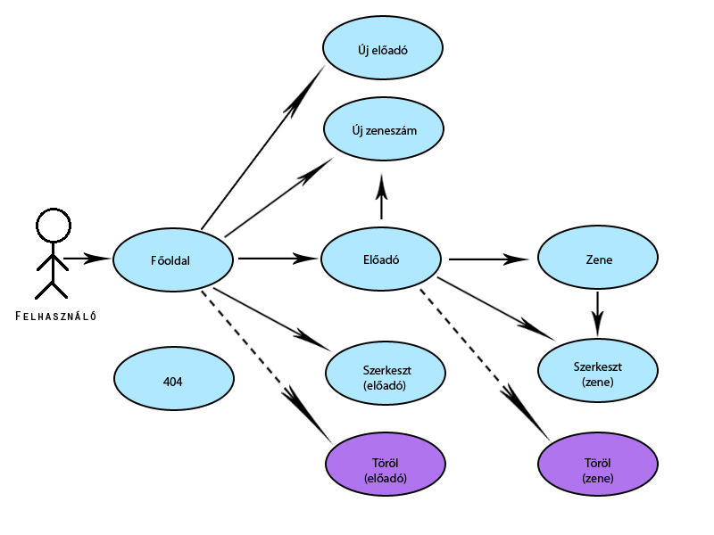
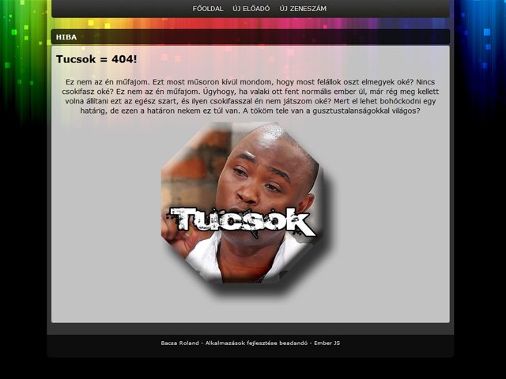
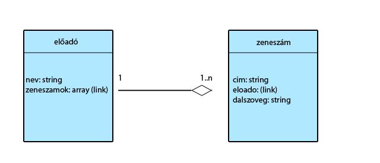
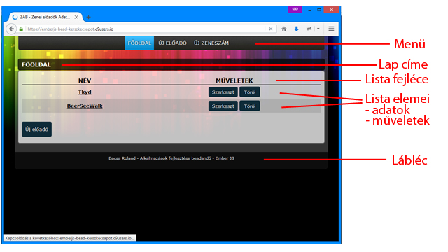

# Alkalmazások fejlesztése
- 3. beadandó feladat
- Bacsa Roland
- AE8YTH
- Rest Api projekt: [restapi-bead2](https://github.com/kerszkecsapot/restapi-bead2)

## Feladat
- Egy webes vastagkliens, azaz egyoldalas alkalmazás készítése Ember.js segítségével. Tartalmaznia kell minimálisan:
 - legalább két modellt, egy-sok kapcsolatban
 - legalább 1 űrlapot
 - legalább 1 listázó oldalt
 - legyen lehetőség új felvételére
 - legyen lehetőség meglévő szerkesztésére
 - legyen lehetőség meglévő törlésére
 - REST API végpont kialakítása
 - szerveroldali perzisztálás fájlba

## Használatieset-modell


### Használatieset szöveges leírása
- Főoldal: a felhasználó a weboldalt megnyitva ezen az oldalon találja magát.
 - Tartalmazza az előadók listáját.
 - A "Műveletek" oszlop alatti gombok segítségével lehetősége van a felhasználónak szerkeszteni ill. törölni az egyes előadókat.
 - Az előadó nevére kattintva az előadó adatait tartalmazó "Előadó" oldalra kerülünk.
- Előadó:
 - Tartalmazza az előadóhoz tartalmazó zeneszámok listáját.
 - A "Műveletek" oszlop alatti gombok segítségével lehetősége van a felhasználónak szerkeszteni ill. törölni az egyes zeneszámokat.
 - A zeneszám címére kattintva a zeneszám dalszövegét tartalmazó "Zene" oldalra kerülünk.
- Zene:
 - Tartalmazza az előadóhoz tartalmazó zeneszám adatait: előadó, cím, dalszöveg.
- Új előadó:
 - Lehetőségünk van új előadó felvételére.
- Új zeneszám:
 - Lehetőségünk van új zeneszám felvételére.
- 404: ha nem létező oldalt nyitunk meg ez a lap tájékoztat minket erről a hibánkról.
 - 

## Tervezés
### Adatbázis terv


### Oldal felépítése


## Fejlesztés
### Fejlesztőeszközök
- c9.io
- EmberJS

### Fejlesztői utasítások
- Repository klónozása:
 - Rest API: `git clone https://github.com/kerszkecsapot/restapi-bead2`
 - EmberJS: `git clone https://github.com/kerszkecsapot/emberjs-bead`
- `npm install`
- `bower install`

### Helperek
- help.js:
```
import Ember from 'ember';

export default Ember.Helper.helper(function(params) {
    var str = params[0];
    return new Ember.Handlebars.SafeString(str.replace(/(<)|(>)/g, '').replace(/(\n)/g, '<br />'));
});
```
  - A dalszövegek megjelenítéséhez szükséges.
  - Szükséges a HTML tagek értelmezése.
  - "\n" sorvégek HTML tagé alakítása.
  - A biztonság érdekében a "<" és ">" karaktereket törli

### Futtatás
- Rest Api elindítása szükséges!
- `ember server`

### Tesztelés
- Automatikusan generált tesztfájlok: 'test/'
- `ember test`
- `ember test --server`

### Kód generálás
- `ember build`
- vagy `ember build --environment production`